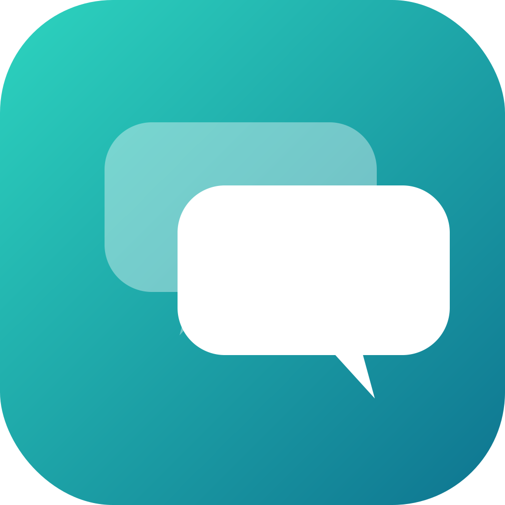
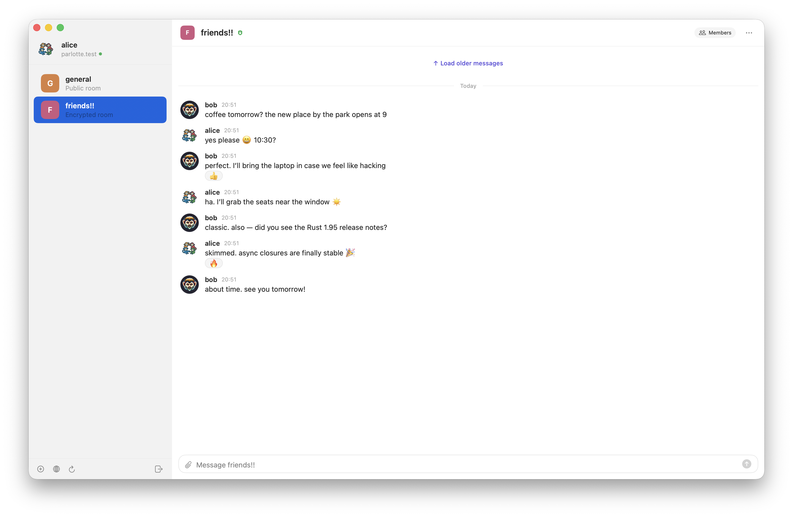

<p align="center">
  
</p>

# Parlotte

A fast, native Matrix client for macOS.

No Electron, no web views — SwiftUI from the ground up. End-to-end encrypted by default, with cross-signing and key backup. Works with any standard Matrix homeserver.

<p align="center">
  
</p>

## Status

In active development. First TestFlight build is being prepared. iOS next.

## Links

- [Landing](https://nxthdr.github.io/parlotte/) · [Privacy](https://nxthdr.github.io/parlotte/privacy/) · [Support](https://nxthdr.github.io/parlotte/support/)
- [Roadmap](ROADMAP.md) · [Architecture notes](CLAUDE.md)

## Building

```bash
cargo test -p parlotte-core             # Rust unit tests
cd apple/Parlotte && swift run Parlotte # Run the app (dev mode)
./scripts/build-app.sh                  # Build a signed .app bundle
```

## License

MIT
